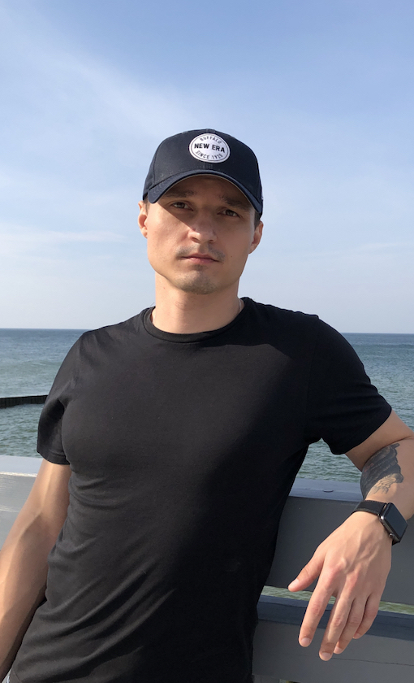

# Моторин Алексей

## О себе: 

Закончил курс нетологии по программе iOS-разработчик. 

Ключевые навыки:
* Программирование на Swift;
* Понимание принципов ООП;
* GIT;
* UIKIT;
* верстка кодом/XIB 
* Auto Layout  
* Создание адаптивного интерфейса приложения и работа с анимацией;
* Понимание жизненного цикла UIViewController
* Знание паттернов

**Мое фото**:

.
